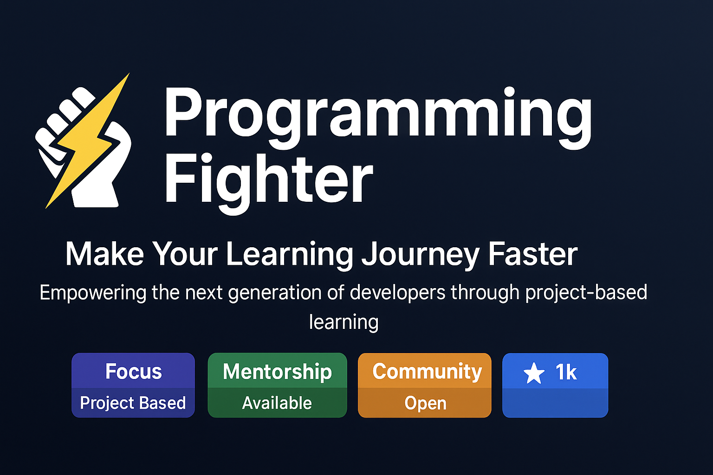

<!-- Banner / Logo -->

  

<h1 align="center">🚀 Programming Fighter</h1>

Make Your Learning Journey Faster | Empowering the next generation of developers through project-based learning

---

## 📖 About Us
**Programming Fighter** is a modern e-learning platform revolutionizing how people learn programming and tech skills.  
We bridge the gap between **theory & real-world application** through project-based learning and expert mentorship.

---

## 🌍 Our Vision
*"To create a world where anyone, anywhere can transform their lives through accessible, practical tech education."*

---

## 💡 Core Values
- 🛠️ **Practicality First:** Focus on real-world skills over abstract theory  
- 👨‍🏫 **Mentorship Matters:** Direct access to industry professionals  
- ⏰ **Learning Flexibility:** Anytime, anywhere education  
- 🤝 **Community Driven:** Collaborative learning environment  
- 🎯 **Career Focused:** Skills that translate to job opportunities  

---

## ✨ What Makes Us Different?
🔥 **Project-Centric Approach** – Build real-world applications from day one  
👨‍💻 **Industry-Expert Instructors** – Learn from active professionals  
🔄 **Continuous Curriculum Updates** – Stay up-to-date with industry trends  
🎯 **Job-Ready Focus** – Resume prep, interview training & portfolio building  

---

## 📚 Our Offerings
### 🎓 Learning Paths
- **Full Stack Development** – MERN, MEAN, Django  
- **Mobile Development** – Flutter, React Native, Swift  
- **Data Science & AI** – Python, TensorFlow, ML  
- **DevOps & Cloud** – AWS, Docker, Kubernetes  
- **Quality Assurance** – Automation Testing, Selenium  

### 🛠 Features
- ✅ Interactive coding environment  
- ✅ Peer code reviews  
- ✅ 1:1 mentorship sessions  
- ✅ Capstone projects  
- ✅ Career support services  

---

## 🌐 Join Our Community
- 🌍 **Website:** [programming-fighter.com](https://www.programming-fighter.com)  
- 📧 **Email:** support@programming-fighter.com  
- 💼 **LinkedIn:** [Programming Fighter](https://www.linkedin.com/company/programming-fighter)  

---

## 🏆 Motto
**"From beginner to job-ready developer - faster than you thought possible."**  

---

  <b>✨ Start your journey today at <a href="https://www.programming-fighter.com">programming-fighter.com</a> ✨</b>

---

## 📌 Badges & Stats

  
  
  
  

---

  Made with ❤️ by <b>Programming Fighter</b>

